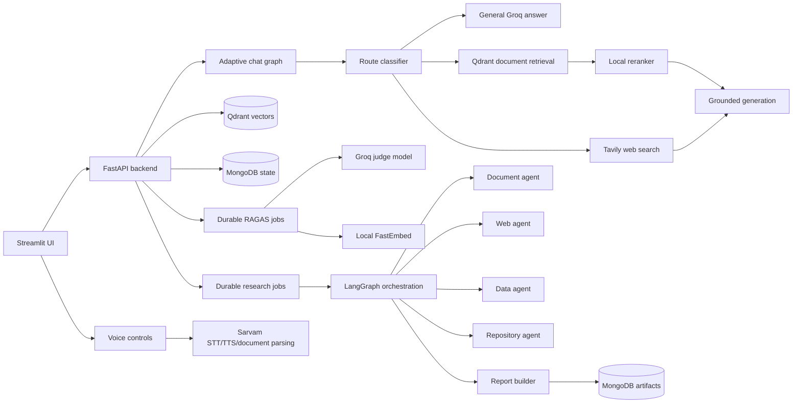

# AgentForge AI

AgentForge AI is an educational multi-agent AI workspace built to demonstrate practical RAG,
agent orchestration, durable background jobs, response evaluation, repository analysis, dataset
analysis, and multilingual voice support in one deployable project.

The project is intentionally designed for demo and interview discussion rather than enterprise
production. Authentication is not enabled. Workspace IDs separate demo data, but they are not
access-control credentials.

## What it does

- Chat with uploaded documents using Retrieval-Augmented Generation.
- Route questions between uploaded-document answers, general LLM answers, web search, and hybrid
  document-plus-web responses.
- Evaluate chat answers with optional RAGAS diagnostics.
- Run multi-agent research jobs that produce downloadable reports.
- Analyze CSV/JSON/XLSX datasets and generate charts.
- Upload repository ZIP files and generate codebase architecture explanations.
- Use Sarvam-backed speech-to-text and text-to-speech for multilingual voice interactions.
- Manage multiple demo workspaces from the Streamlit UI.

## Core features

### Adaptive RAG chat

The Chat workspace is for quick Q&A. Each query is routed through the most appropriate path:

- `index`: answer from uploaded workspace documents.
- `general`: answer directly with the LLM for stable/general questions.
- `search`: use Tavily web search for current or external information.
- hybrid behavior: when uploaded-document evidence is relevant but insufficient, the answer can
  combine indexed document evidence with clearly labelled web evidence.

Document answers use local text extraction, chunking, FastEmbed embeddings, Qdrant vector search,
local reranking, and Groq-based answer generation.

### Multi-agent research workspace

The Research workspace is for longer tasks that need reports or multiple tools. It uses a
LangGraph supervisor-worker workflow:

- `supervisor`: chooses specialist agents.
- `document_investigator`: retrieves uploaded-document evidence.
- `web_researcher`: gathers external web evidence.
- `data_analyst`: summarizes datasets and creates charts.
- `repository_analyst`: inspects uploaded source-code ZIPs safely as text.
- `deliverable_builder`: creates Markdown reports and downloadable artifacts.

Research jobs are asynchronous and durable: jobs are stored in MongoDB, leased by a background
worker, checkpointed by LangGraph, and streamed back to the UI through persisted events.

### Repository analysis

Repository ZIPs are treated as untrusted text. The app rejects unsafe paths, ignores binaries and
vendor/generated folders, stores safe source files in MongoDB, and uses bounded tools for listing,
reading, and searching code. It can explain project purpose, architecture, entry points, technology
roles, data/control flow, and limitations with source-file evidence.

### Dataset analysis

The data agent accepts CSV, JSON/JSONL, and XLSX files. It stores bounded dataset batches in
MongoDB, detects numeric/categorical columns, calculates summaries, derives profit when revenue and
cost columns exist, ranks top/bottom performers, and generates a chart artifact.

### RAGAS response evaluation

Chat responses can be evaluated asynchronously. The app stores response snapshots and queues
evaluation jobs without blocking or changing the original answer. Metrics are diagnostic only, not
hard correctness guarantees.

### Multilingual voice

Sarvam integrations provide optional speech-to-text, text-to-speech, and language-aware behavior.
English documents use local parsing by default, while non-English/Indic documents can use Sarvam
document digitization when configured.

## Architecture



## Tech stack

| Layer | Technology |
| --- | --- |
| Frontend | Streamlit |
| Backend | FastAPI, Pydantic, Uvicorn |
| Orchestration | LangGraph |
| LLM provider | Groq |
| Web search | Tavily |
| Vector database | Qdrant |
| Metadata/state store | MongoDB |
| Embeddings | FastEmbed local ONNX models |
| Reranking | Local FlashRank-style reranker |
| Evaluation | RAGAS |
| Speech/document digitization | Sarvam AI |
| Packaging | Docker, Docker Compose |

## Project structure

```text
.
|-- streamlit_app/              Streamlit Home, Chat, and Research pages
|-- src/
|   |-- api/                    FastAPI routes
|   |-- agents/                 Specialist agents and report builder
|   |-- core/                   Settings, errors, prompt budgeting
|   |-- data/                   Dataset and repository ingestion
|   |-- db/                     MongoDB persistence stores
|   |-- evaluation/             RAGAS evaluation jobs and benchmark
|   |-- llms/                   Groq, embedding, reranking factories
|   |-- memory/                 MongoDB chat history
|   |-- orchestration/          LangGraph research workflow and job runner
|   |-- rag/                    Document upload, retrieval, and chat graph
|   |-- services/               Language and speech services
|-- evals/                      Golden RAG evaluation dataset
|-- tests/                      Unit and regression tests
|-- Dockerfile                  Backend image
|-- Dockerfile.streamlit        Frontend image
|-- docker-compose.yml          Local demo stack
|-- INSTRUCTIONS.md             Detailed setup, API examples, deployment notes
|-- CODE_STYLE_GUIDE.md         Project code style guide
```

## Run locally

1. Copy environment variables:

   ```powershell
   Copy-Item .env.example .env
   ```

2. Fill the required keys in `.env`, especially:

   ```env
   GROQ_API_KEY=...
   TAVILY_API_KEY=...
   QDRANT_API_KEY=local-dev-key
   MONGO_ROOT_USERNAME=admin
   MONGO_ROOT_PASSWORD=password
   ```

3. Start the full stack:

   ```powershell
   docker compose up --build -d
   ```

4. Open:

   - Streamlit UI: http://localhost:8501
   - FastAPI docs: http://localhost:8000/docs

5. Stop:

   ```powershell
   docker compose down
   ```

See [INSTRUCTIONS.md](INSTRUCTIONS.md) for full environment variables, query examples, API
reference, Render deployment notes, and troubleshooting.

## Scope and limitations

- Built for educational/demo use, not production security.
- Authentication and authorization are intentionally absent.
- Workspace IDs organize data but are not private credentials.
- Free-tier Groq/Sarvam/Tavily limits can affect live demos.
- Research jobs are durable at graph-node boundaries, not in the middle of one external API call.
- Uploaded repository code is inspected as text only and is never executed.
- A simple Render deployment is suitable for demos; no load balancer or multi-node infrastructure is
  required.
